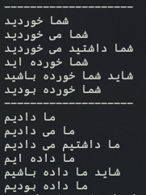

<h1>تولید کننده فعل</h1>

این برنامه برای تولید فعل های فارسی/عربی/انگلیسی است.

<h2>فعل های تولید شده</h2>

<h3>فعلا های ماضی(گذشته)</h3>
<h5>گذشته ساده(مطلق)</h5>
<h5>گذشته استمراری</h5>
<h5>گذشته مسمتر</h5>
<h5>گذشته نقلی</h5>
<h5>گذشته التزامی</h5>
<h5>گذشته بعید</h5>
 

<h2>در لیست انجام</h2>

<h3>تولید فعل های مضارع(حال) فارسی</h3>
<h5>مضارع اخباری</h5>
<h5>ماظارع التزامی</h5>
<h5>مضارع مستمر</h5>
 
<h3>تولید فعل های مضارع(حال) عربی</h3>
<h5>**</h5>
 
<h3>تولید فعل های ماضی(حال) عربی</h3>
<h5>**</h5>
 
<h3>تولید فعل های انگلیسی</h3>
<h5>**</h5>

<h1>کاربرد ها</h1>

شما می توانید با استفاده از مصدر فعل های مختلفی بسازید.

<h1>آیا میتوانید کمک کنید؟</h1>

اگر میتوانید به ما کمک کنید، ما نیز بسیار خوشحال 
میشویم. 
اگر در زمینه ادبیات نیز تخصص دارید به ما کمک کنید تا بهتر بتوانیم این برنامه را توسعه دهید.

<h1>مثال</h1>

